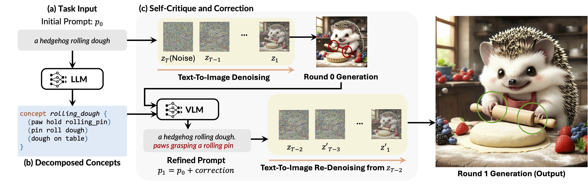

# DetailScribe


This is an implementation of **DetailScribe**, as described in the paper [Generating Fine Details of Entity Interactions].


DetailScribe achieves fine-grained image generation using a decomposition-augmented refinement procedure. The repository includes:

* 🦔 A streamlined Diffusers-based implementation of **DetailScribe**.
* 📚 **InterActing**: an interaction-focused dataset with 1000 fine-grained prompts.
* 👩🏻‍🔬 Human evaluations of images generated by DetailScribe and baseline models for 50 selected prompts.


## Getting Started

### Installation

Clone the repository:
```
git clone https://github.com/gxy000/DetailScribe.git
cd DetailScribe
```

Create a [conda](https://conda.io/) environment and install dependencies:
```
pip install -r requirements.txt
```


## Dataset

### InterActing

The prompts in the **InterActing** dataset are located at:

```
InterActing/data/original_prompt
```

### Human Evaluation

Download the generated images and corresponding human evaluation data from [Dropbox](https://www.dropbox.com/scl/fo/wepr3j5kg6fthvj2d8kq9/APysjf2xwRUYWxDG9hyoekw?rlkey=9esh8btznjy6nby0pzbinsxzx&st=f3275099&dl=0).


## Usage

### Inference
Below are example scripts for running **DetailScribe** on prompts in JSONL format:

**Generate decomposed components**


```
python InterActing/prompt_completion.py --data_dir InterActing/data \
--scenario toy_data_001 --type decomposition
```

**Generate images:**

Available experiment names:

- `DetailScribe` (main model)
- Baselines: `init_only` (vanilla SD3.5 and SD + multi-seed), `gpt_rewrite` (SD + GPT Rewrite), `gpt_refine` (SD + GPT refine), `dalle3`

```
python DetailScribe/DetailScribe.py \
--prompt_path InterActing/data/decomposition/toy_data_001.jsonl \
--seed 2628670643 \
--experiment_name DetailScribe
```

### Evaluation

To evaluate generated images, use metrics such as `ImageReward`, `CLIPScore`, `BLIP-VQA`, or `gpt`.

**Note:** Ensure your OpenAI API key is set:

```
export OPENAI_API_KEY="your-key-here"
```

**Evaluation scripts:**

```
data_name="toy_data_001"

python DetailScribe/results_cleanup_and_preprocess.py \
--new_prompt_path "results/${data_name}/new_prompt_2628670643_detailscribe.jsonl" \
--primary_seed 2628670643 --multi_seed 2628670647

python DetailScribe/auto_evaluators.py \
"results/eval/dict/main_${data_name}.jsonl" \
--metric gpt \
--by_scale
```


## Acknowledgements

*(TODO)*


## Contact

For questions or feedback, contact: [gxy@mit.edu](mailto\:gxy@mit.edu). Enjoy!

